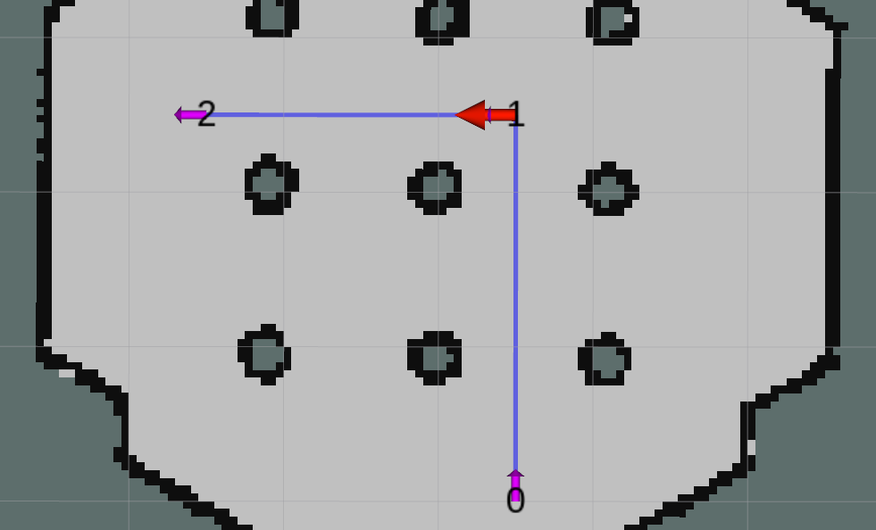
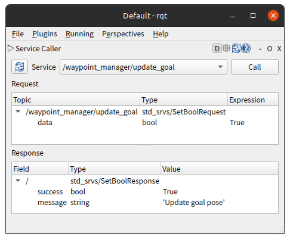
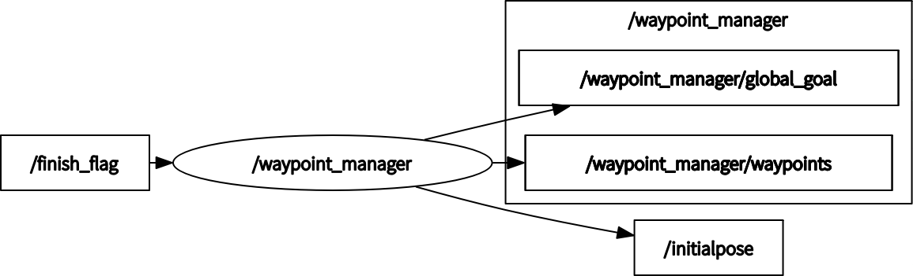

# waypoint_manager_ros

[](https://github.com/ToshikiNakamura0412/waypoint_manager_ros/actions/workflows/lint.yaml)
[](https://opensource.org/licenses/MIT)

The ROS package for waypoint management

Publish the goal pose of the ID specified as the parameter start as the initial pose of the robot at node startup

Publish the goal pose in order from id "parameter start + 1"

<p align="center">
  
</p>

## Environment
- Ubuntu 20.04
- ROS Noetic

## Install and Build
```
# clone repository
cd /path/to/your/catkin_ws/src
git clone https://github.com/ToshikiNakamura0412/waypoint_manager_ros.git

# build
cd /path/to/your/catkin_ws
rosdep install -riy --from-paths src --rosdistro noetic # Install dependencies
catkin build waypoint_manager_ros
```

## How to use
```
roslaunch waypoint_manager_ros waypoint_manager.launch
```

## Running the demo
```
roslaunch waypoint_manager_ros test.launch
```

update goal pose manually
```
rqt
```

<p align="center">
  
</p>

## Node I/O


## Nodes
### waypoint_manager
#### Published Topics
- /initialpose (`geometry_msgs/PoseWithCovarianceStamped`)
  - The initial pose of the robot
- ~\<name>/global_goal (`geometry_msgs/PoseStamped`)
  - The goal pose
- ~\<name>/waypoints (`visualization_msgs/MarkerArray`)
  - Visualization of waypoints

#### Subscribed Topics
- /finish_flag (`std_msgs/Bool`)
  - The flag to finish the current goal

#### Service Topics
- ~\<name>/update_goal
  - Update the goal pose

#### Parameters
- ~\<name>/<b>hz</b> (int, default: `1` [Hz]):<br>
  The rate of main loop
- ~\<name>/<b>frame_id</b> (str, default: `map`):<br>
  The frame id of topics
- ~\<name>/<b>waypoint_file</b> (str, default: `waypoints.yaml`):<br>
  The file path of waypoints
- ~\<name>/<b>start</b> (int, default: `0`):<br>
  The start id of robot
- ~\<name>/<b>width_ratio</b> (float, default: `1.0`):<br>
  The width ratio of edge between waypoints
- ~\<name>/<b>is_visible_text</b> (bool, default: `True`):<br>
  The flag to visualize text of id
- ~\<name>/<b>is_visible_edge</b> (bool, default: `True`):<br>
  The flag to visualize edge between waypoints
